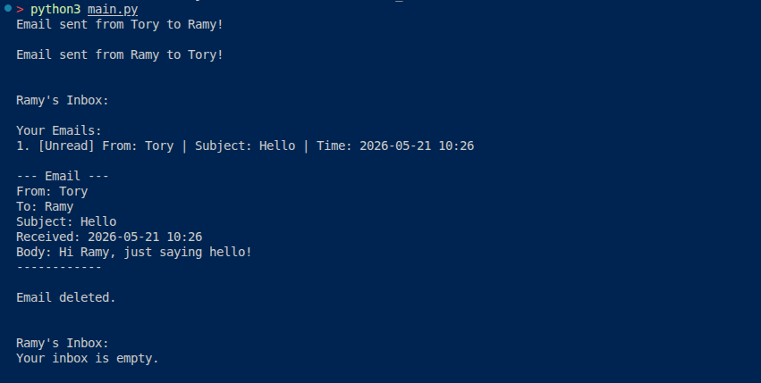

# Email Simulator

A simple, object-oriented Python email simulation system that demonstrates core OOP principles through a console-based email client.

---

## Overview

The **Email Simulator** is a command-line application that allows users to send, receive, read, and delete emails. It is built using Python classes to model real-world email functionality (`User`, `Inbox`, and `Email`).

This project is ideal for learning Object-Oriented Programming, class relationships, and basic Python best practices.

## Features

- ✅ Create multiple users
- ✅ Send emails between users
- ✅ Inbox management (list, read, delete)
- ✅ Email status tracking (Read/Unread)
- ✅ Timestamps and professional email formatting
- ✅ Clean, well-documented, PEP 8 compliant code

## Project Structure

```plaintext
email-simulator/
├── main.py                 # Main script with demo
├── email_system.py         # (Optional) Classes can be moved here
└── README.md
```

## Requirements

- Python 3.8 or higher
- No external dependencies

## Installation

1. Clone or download the project:

```bash
git clone <this-repository-url>
cd email_simulator
```

1. Run the simulator:

```bash
python main.py
```

## Usage Example

```python
# Creating users
tory = User("Tory")
ramy = User("Ramy")

# Sending emails
tory.send_email(ramy, "Hello", "Hi Ramy, just saying hello!")
ramy.send_email(tory, "Re: Hello", "Hi Tory, hope you are fine.")

# Checking inbox
ramy.check_inbox()

# Reading and deleting emails
ramy.read_email(1)
ramy.delete_email(1)
```

## Classes

### `Email`

Represents an individual email with sender, receiver, subject, body, timestamp, and read status.

### `Inbox`

Manages a list of emails with methods to receive, list, read, and delete emails.

### `User`

Represents a user with a name and their personal inbox. Handles sending emails and inbox operations.

## Demo Output

When you run `main.py`, you will see a full demonstration of sending emails, viewing the inbox, reading messages, and deleting them.

### Future Enhancements

- Add attachments support
- Implement email search and filtering
- Create a simple text-based UI / menu system
- Add reply functionality
- Save/load inbox using JSON

---

#### Program Output



---
